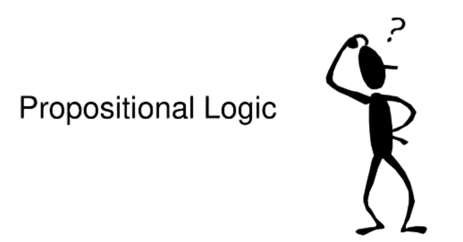

# Propositional Logic in Artificial Intelligence

## Learning Outcome:
<i>At the end of the class, students should be able to:</i>

* Define primitive statements  
* Form a compound statements  
* define negation, conjunction, disjunction, conditional, biconditional, tautology, contradiction and contingency statements.  
* construct truth table.  

## LOGICAL CONNECTIVES
<i>Main components of symbolic logic are:</i>  

- Proposition/Statements
- Connectives

## PROPOSITION/STATEMENTS

- A proposition is a declarative sentence that is either true or false.
- The truth or falsify of a statement is called truth value.
- Usually denoted by letters p, q, r, s and so on.
<i>Example:</i>

✔ You will be late to school if you miss the bus;  
✔ Ms. Nina will have a broader audience next month; 
✔ I did not join the competition; 
✔ Today is Monday; 
✔ I love reading thriller books; 
✔ The number 3 is an odd integer; 

## Logical connectives and compound statements

| <b>Logical Connective</b> | <b>Compound statement</b> | <b>Symbolic compound statement</b> |
| ------------- | ------------- | ------------- |
| ∧  | p and q (conjunction)  | p ∧ q  |
| ∨ | p or q (disjunction)  | p ∨ q  |
| →  | if p then q (conditional/implication)  | p → q  |
| ↔ | p if and only if q (biconditional)  | p ↔ q  |